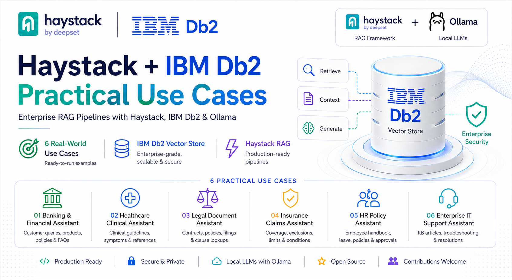
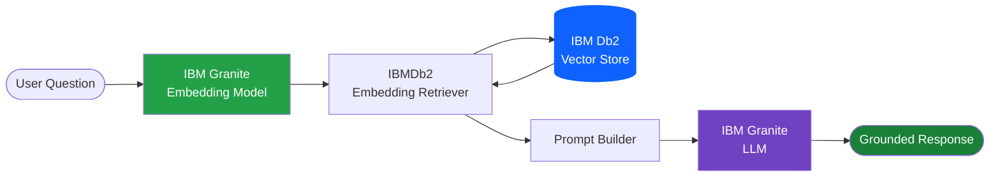

# Haystack + IBM Db2 Practical Use Cases



> Practical, production-ready Retrieval-Augmented Generation (RAG) examples built using **Haystack**, **IBM Db2 Vector Store**, **IBM Granite Embedding Models**, **IBM Granite LLMs**, and **Ollama**.


---

# Overview

This repository demonstrates how to build enterprise Retrieval-Augmented Generation (RAG) applications using the **official IBM Db2 integration for Haystack**.

Each example is intentionally designed to be self-contained and focuses on a real-world enterprise use case. Every application shows how IBM Db2 can be used as a native vector database for semantic search while Haystack orchestrates the complete RAG pipeline.

The examples use:

- IBM Db2 Vector Store
- Haystack Pipelines
- IBM Granite Embedding Models
- IBM Granite LLMs
- Ollama
- Native Vector Similarity Search

Whether you're learning Haystack, evaluating IBM Db2 Vector Search, or building enterprise AI assistants, these practical examples provide a solid starting point.

---

# Practical Use Cases

| Example | Description |
|----------|-------------|
| **01 Banking & Financial Assistant** | Answers customer questions using banking policies, FAQs, product documentation, and internal knowledge bases. |
| **02 Healthcare Clinical Knowledge Assistant** | Retrieves clinical guidelines and healthcare documentation while generating safe, grounded responses. |
| **03 Legal Document Assistant** | Performs semantic search across legal contracts, agreements, policies, and compliance documentation. |
| **04 Insurance Claims Assistant** | Retrieves insurance policy coverage, exclusions, claim conditions, and benefits. |
| **05 HR Policy Assistant** | Answers employee questions from HR policies, employee handbooks, leave policies, and internal documentation. |
| **06 Enterprise IT Support Assistant** | Provides troubleshooting assistance using enterprise IT knowledge base articles and internal documentation. |

---

# Repository Structure

```text
haystack-db2-practical-usecases/

│── cover.png
│── README.md
│
├── 01_banking_assistant.py
├── 02_healthcare_assistant.py
├── 03_legal_assistant.py
├── 04_insurance_assistant.py
├── 05_hr_assistant.py
└── 06_it_support_assistant.py
```

---

# Architecture

Every example follows the same Retrieval-Augmented Generation workflow.


# Technology Stack

| Component | Technology |
|-----------|------------|
| AI Framework | Haystack |
| Vector Database | IBM Db2 |
| Embedding Model | IBM Granite Embedding 278M |
| Language Model | IBM Granite 3.3 |
| Local Inference | Ollama |
| Programming Language | Python |

---

# Prerequisites

Before running these examples, ensure you have:

- Python 3.11+
- IBM Db2 with Vector Search enabled
- Ollama installed locally
- IBM Granite Embedding Model
- IBM Granite 3.3 Model

---

# Installation

Clone the repository.

```bash
git clone https://github.com/<your-username>/haystack-db2-practical-usecases.git

cd haystack-db2-practical-usecases
```

Install the dependencies.

```bash
pip install -r requirements.txt
```

---

# Download the Models

```bash
ollama pull granite-embedding:278m

ollama pull granite3.3:8b
```

---

# Configure IBM Db2

Set your Db2 credentials before running any example.

```bash
export DB2_USERNAME=db2inst1

export DB2_PASSWORD=password

export DB2_HOST=localhost

export OLLAMA_URL=http://localhost:11434
```

---

# Running an Example

Run any assistant directly.

```bash
python 01_banking_assistant.py
```

or

```bash
python 02_healthcare_assistant.py
```

or

```bash
python 03_legal_assistant.py
```

or

```bash
python 04_insurance_assistant.py
```

or

```bash
python 05_hr_assistant.py
```

or

```bash
python 06_it_support_assistant.py
```

---

# What You'll Learn

This repository demonstrates how to:

- Build Retrieval-Augmented Generation (RAG) pipelines with Haystack
- Store vector embeddings in IBM Db2
- Perform semantic similarity search using IBM Db2 Vector Store
- Generate embeddings with IBM Granite Embedding Models
- Generate grounded responses with IBM Granite LLMs
- Build production-ready enterprise AI assistants
- Develop modular Haystack pipelines that are easy to customize

---

# Applications Included

## Banking & Financial Assistant

Build a customer-facing banking assistant capable of answering questions from policies, product documentation, and FAQs using semantic retrieval.

---

## Healthcare Clinical Knowledge Assistant

Retrieve clinical guidelines and medical documentation while ensuring responses remain grounded and safe.

---

## Legal Document Assistant

Search legal contracts, agreements, compliance documentation, and internal policies using semantic search.

---

## Insurance Claims Assistant

Answer questions related to insurance coverage, claim policies, exclusions, and policy conditions.

---

## HR Policy Assistant

Provide employees with accurate answers from company handbooks, leave policies, onboarding guides, and HR documentation.

---

## Enterprise IT Support Assistant

Retrieve internal knowledge base articles and provide step-by-step troubleshooting instructions for enterprise IT support.

---

# Repository Highlights

- Official IBM Db2 Integration for Haystack
- IBM Db2 Native Vector Store
- IBM Granite Embedding Models
- IBM Granite Large Language Models
- Local inference with Ollama
- Production-ready RAG Pipelines
- Enterprise AI Assistant examples
- Easy to customize for your own documents and knowledge bases

---

# Learn More

Want to learn more about the official IBM Db2 integration for Haystack? Explore the announcement, technical guide, and complete walkthrough below.

## :loudspeaker: Official Announcement

**Build Grounded AI Applications with the new IBM Db2 Integration for Haystack**

https://www.ibm.com/new/announcements/build-grounded-ai-applications-with-the-new-ibm-db2-integration-for-haystack

---

## :book: Technical Guide

https://lnkd.in/gCqkRnbu

---

## :movie_camera: Complete Video Walkthrough

https://lnkd.in/g7ZpWM_u

---

## :books: Additional Resources

IBM Db2 Database

https://www.ibm.com/products/db2-database

Haystack Documentation

https://docs.haystack.deepset.ai/

IBM Granite Models

https://www.ibm.com/granite

Ollama

https://ollama.com/

---

# Contributing

Contributions are always welcome.

If you'd like to improve an example, add a new enterprise use case, or enhance the IBM Db2 + Haystack ecosystem, feel free to open an Issue or submit a Pull Request.

---

# Acknowledgements

Built using:

- Haystack by deepset
- IBM Db2
- IBM Db2 Vector Store Integration
- IBM Granite Models
- Ollama
- Python

Special thanks to everyone contributing to the Haystack and IBM Db2 open-source ecosystem.

---

## :star: Support

If you found this repository helpful, please consider giving it a **Star** on GitHub. It helps others discover the project and supports continued development of enterprise AI examples using **Haystack** and **IBM Db2**.
